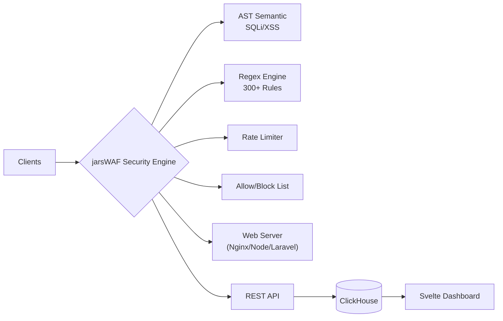

# 🛡️ jarsWAF

**High-performance Web Application Firewall** — reverse proxy yang menginspeksi, memfilter, dan mencatat HTTP traffic real-time. Dibangun dengan **Rust + Pingora (Cloudflare) + eBPF XDP + Svelte**.

> *"Secepat Pingora, sekuat Safeline."*

---

## Fitur Utama

| Lapisan | Kemampuan |
|---------|-----------|
| **L7 Proxy** | Reverse proxy berbasis Pingora (asinkron, zero-copy forwarding) |
| **Deteksi** | AST Semantic tokenizer (SQLi, XSS) + Signature-based regex 300+ rules |
| **Normalisasi** | Recursive URL decode → HTML entity → NFKC Unicode → lowercase |
| **Rate Limiting** | Per-VHost token bucket, opsi distributed via Redis |
| **TLS** | Auto-provisioned Local CA, custom cert upload, ACME (Let's Encrypt) |
| **GeoBlok** | MaxMind GeoIP per negara per VHost |
| **eBPF** | XDP drop di level kernel (Linux ≥ 5.8) — mitigasi DDoS |
| **Reputasi** | Cross-node IP reputation blocklist sync |
| **Dashboard** | Svelte real-time UI, WebSocket, Globe attack map, xterm.js terminal |
| **Logging** | Async pipeline: file JSON → ClickHouse → SQLite → remote controller |
| **Discovery** | Auto-detect Docker & system services via port scan |

---

## Persyaratan Sistem

### Full Stack (Controller + ClickHouse + Dashboard)
- **CPU**: 2 core (min) / 4+ core (recommended)
- **RAM**: 4 GB (min) / 8+ GB (recommended)
- **OS**: Ubuntu 22.04+, Debian 12+
- **Deps**: Rust ≥ 1.75, Node.js ≥ 20, Docker, git

### Agent Only (Lightweight VPS)
- **CPU**: 1 core | **RAM**: 512 MB (binary ~30 MB)
- **OS**: Linux, macOS — **Windows via WSL2 saja**

> Pingora (Cloudflare) & nix crate hanya support Unix. **Windows native tidak didukung** — jalankan Agent di WSL2 (Ubuntu) atau gunakan Linux/macOS.

### Dukungan OS

| OS | eBPF XDP | L7 Proxy | Catatan |
|----|----------|----------|---------|
| Linux ≥ 5.8 | ✅ | ✅ Pingora | Produksi — rekomendasi utama |
| Linux < 5.8 | ❌ | ✅ Pingora | Tetap jalan, tanpa DDoS kernel |
| macOS | ❌ | ✅ Pingora | Develop & testing |
| Windows | ❌ | ❌ | **WSL2 required** untuk Agent |

---

## Quick Start

### 1. One-Command Install (Agent saja)
```bash
sudo bash -c "$(curl -fsSLk https://raw.githubusercontent.com/Azhar457/jarswaf/main/install.sh)"
```

### 2. Automated Full Stack
```bash
git clone https://github.com/Azhar457/jarswaf.git && cd jarswaf
./manager.sh deps     # Install Rust, Node, Docker
./manager.sh install  # Deploy via Docker
```

### 3. Docker Only
```bash
git clone https://github.com/Azhar457/jarswaf.git && cd jarswaf
docker compose up -d --build
# Dashboard: http://<IP>:8080
```

### 4. Manual Build (Any OS)
```bash
git clone https://github.com/Azhar457/jarswaf.git && cd jarswaf

# Build
cd dashboard && npm install && npm run build && cd ..
cargo build --release

# Start
export CLICKHOUSE_USER=default CLICKHOUSE_PASSWORD=jarswaf
./target/release/jarswaf controller &
./target/release/jarswaf agent --controller http://localhost:8080 &
```

### 5. Agent Only (VPS minim)
```bash
./manager.sh agent-deploy
```
Logging mode bisa `file`, `remote` (push ke Controller), atau `clickhouse`.

---

## Konfigurasi Multi-Domain

```toml
[[vhosts]]
name = "python-app"
hosts = ["app.example.com"]
backend = "127.0.0.1:9500"
rules = ["SQLI-*", "XSS-*", "LFI-*", "BOT-*"]
ssl = "Auto (Local CA)"
```

Edit `/opt/jarswaf/config.toml` lalu restart Agent.

---

## Arsitektur



---

## Struktur Project

```
src/
├── main.rs           # CLI entry (controller / agent)
├── proxy_engine.rs   # Pingora proxy — hot path
├── agent/            # Agent node (server, discovery, websocket, metrics)
├── rules.rs          # WAF engine (AST semantic + regex signature)
├── logging.rs        # Log worker (file/remote/clickhouse/sqlite)
├── config.rs         # TOML config schema
├── proxy.rs          # GeoIP, CIDR matching
├── vhost.rs          # Virtual host router
├── controller/       # REST API controller
├── dashboard/        # Svelte SPA frontend
├── jarswaf-ebpf/     # eBPF XDP programs (Linux)
└── xtask/            # Build utilities
```

---

## Port Default

| Port | Service | Keperluan |
|------|---------|-----------|
| 8080 | Controller API + Dashboard | Wajib |
| 8123 | ClickHouse HTTP | Wajib |
| 80 | HTTP Proxy (Agent) | Produksi |
| 443 | HTTPS Proxy (Agent) | Produksi |

---

## Perintah Manager

```bash
./manager.sh deps         # Install semua dependensi
./manager.sh build        # Build release + Svelte
./manager.sh install      # Deploy Docker production
./manager.sh agent-deploy # Deploy Agent-only
./manager.sh logs         # Stream log
./manager.sh status       # Cek health
./manager.sh uninstall    # Hapus total
```


## Roadmap

- [x] eBPF XDP DDoS mitigation
- [x] Real-time metrics & dashboard
- [ ] API-based rate limit tier management
- [ ] Gossip protocol config sync
- [ ] Helm chart Kubernetes
- [ ] Binary releases (GitHub Actions)

---

## Lisensi

MIT — lihat [LICENSE](LICENSE).
Untuk security policy, lihat [SECURITY.md](SECURITY.md).
