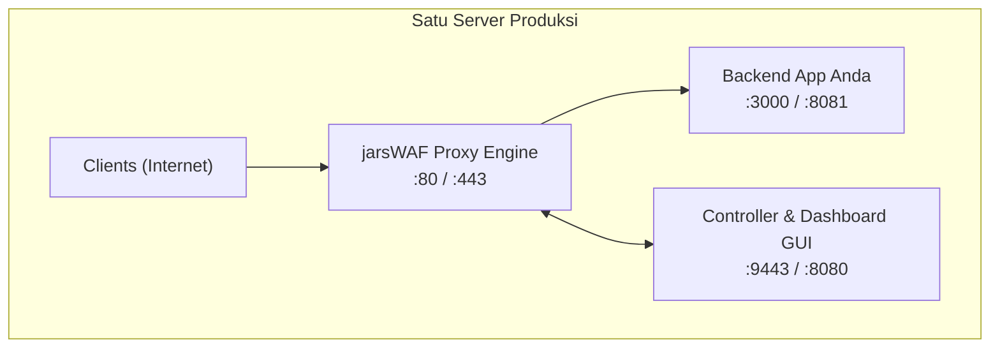
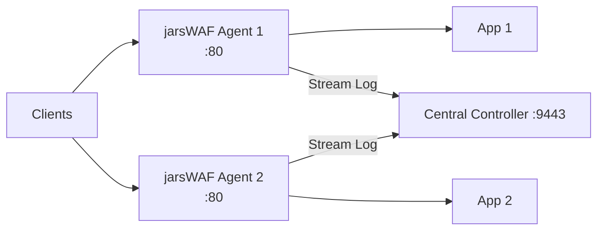

# 🛡️ jarsWAF

**High-performance Web Application Firewall** — reverse proxy modern yang menginspeksi, memfilter, dan memblokir HTTP/HTTPS traffic secara real-time. Dibangun menggunakan **Rust + Pingora (Cloudflare) + eBPF XDP + Svelte + WASM**.

> *"Secepat Pingora, sejelas dan semudah SafeLine."*

---

## 🙏 Inspirasi & Referensi Utama (Inspired & Referenced By)

Kami percaya pada transparansi dan kejujuran penuh. **jarsWAF** tumbuh dan dikembangkan dengan mengambil inspirasi terbaik dari proyek-proyek keamanan & infrastruktur terkemuka:

1. **[Chaitin SafeLine WAF (雷池 WAF)](https://waf.chaitin.com/)**: Inspirasi utama untuk konsep **Standalone All-in-One Experience**, alur kerja instalasi *Zero-Shot*, kemudahan manajemen Reverse-Proxy VHost, serta alur pengamanan password awal dan UI Dashboard monitoring.
2. **[Cloudflare Pingora](https://github.com/cloudflare/pingora)**: Fondasi arsitektur Reverse-Proxy Layer 7 berbasis Rust yang super cepat, asinkron, *memory-safe*, dan *zero-copy forwarding*.
3. **[OWASP Core Rule Set (CRS)](https://coreruleset.org/) & [Coraza WAF](https://coraza.io/)**: Referensi utama dalam penyusunan aturan deteksi signature-based, skor anomali (*anomaly scoring*), serta penanganan teknik deobfuscation/evasion attack (SQLi, XSS, RCE).
4. **[Aya-rs](https://aya-rs.dev/) & Linux eBPF/XDP**: Teknologi pendukung untuk *kernel-level packet filtering* demi mitigasi serangan DDoS langsung di tingkatan driver/network card.
5. **[Svelte](https://svelte.dev/) & [Lucide Icons](https://lucide.dev/)**: Fondasi antarmuka GUI Dashboard modern yang ringan dan real-time.

---

## 🔥 Status Build & Fitur Rilis Baru

| Komponen | Status | Keterangan |
|----------|--------|------------|
| **Standalone SafeLine Mode** | ✅ **Active** | Controller + Dashboard GUI + Embedded Agent WAF berjalan langsung dalam 1 Paket |
| **Auto-Generate Password** | ✅ **Active** | Password acak 16-karakter dibuat otomatis saat instalasi pertama |
| **Forced Password Reset** | ✅ **Active** | Pengguna wajib mengubah password awal pada login pertama di Dashboard |
| **Precompiled Binary (GitHub)**| ✅ **Active** | Rilis biner terkompilasi siap pakai (`musl` static & `glibc`), tanpa tunggu kompilasi lama |
| **Zero-Shot Installer** | ✅ **Active** | installer `install.sh` serba cepat dengan 3 pilihan mode (Standalone, Controller, Agent) |

---

## ⚡ Quick Start: One-Command Installation

Instalasi siap pakai di semua distro Linux (Ubuntu, Debian, Fedora, CentOS, Alpine) tanpa perlu Docker atau Rust toolchain:

```bash
sudo bash -c "$(curl -fsSLk https://raw.githubusercontent.com/Azhar457/jarswaf/main/install.sh)"
```

### Menu Pilihan Mode Installer (`install.sh`)

Saat dijalankan, Anda dapat memilih mode operasi yang diinginkan:

```text
Pilih Mode Instalasi jarsWAF:
1) Standalone Mode (Rekomendasi - SafeLine Style)
   -> Controller + Dashboard GUI + Embedded WAF Agent Proxy dalam 1 Paket
2) Controller Only Mode
   -> Server Manajemen Pusat & Dashboard Analytics saja
3) Agent Only Mode
   -> Node WAF Proxy terpisah yang terhubung ke Central Controller
```

Opsi non-interaktif juga didukung:
```bash
sudo ./install.sh --mode standalone
```

Setelah instalasi selesai, terminal akan menampilkan **Dashboard URL**, **Username (`admin`)**, dan **Password Unik Awal**.

---

## 🔑 Kebijakan Keamanan & Password Awal

1. **Password Otomatis**: jarsWAF tidak menggunakan password default statis (seperti `admin` / `[REDACTED-CREDENTIAL]`). Password unik acak 16-karakter akan dibuat secara otomatis saat pertama kali di-install.
2. **Ubah Password Wajib**: Saat pertama kali login di Dashboard GUI (`http://<server-ip>:9443` atau `8080`), sistem akan menampilkan dialog **"Ubah Password Pertama Kali"** yang mewajibkan Anda membuat password baru yang kuat sebelum membuka akses penuh ke Dashboard.

---

## 🔌 Port Default System

| Port | Service | Deskripsi / Peruntukan |
|------|---------|------------------------|
| **9443** (atau `8080`) | **Dashboard GUI & Controller API** | Dashboard Antarmuka Admin & Management REST API |
| **80** | **WAF HTTP Proxy** | Listening Port Reverse-Proxy Inspeksi Traffic HTTP |
| **443** | **WAF HTTPS Proxy** | Listening Port Reverse-Proxy Inspeksi Traffic HTTPS |
| **8000** | **WAF Dev Proxy** | Default Listening Port Alternatif Mode Development |

---

## 🏗️ Mode Arsitektur Deployment

jarsWAF mendukung 3 skenario deployment:

### 1. Mode Standalone (SafeLine Style — Rekomendasi Single Server)


```mermaid
flowchart TD
    subgraph SingleServer["Satu Server Produksi"]
        Client["Clients (Internet)"] --> WAF["jarsWAF Proxy Engine<br>:80 / :443"]
        WAF --> App["Backend App Anda<br>:3000 / :8081"]
        WAF <--> GUI["Controller & Dashboard GUI<br>:9443 / :8080"]
    end
```
**Cocok untuk:** VPS / Server produksi tunggal. Semua fitur Dashboard & Inspeksi WAF aktif dalam 1 biner/service tanpa perlu install agent terpisah.

### 2. Mode Controller Pusat (Multi-Agent Analytics)

Server khusus yang mengelola log terpusat, aturan global, dan tampilan Dashboard untuk banyak Agent WAF terpisah.

### 3. Mode Agent Only (Lightweight Node)


```mermaid
flowchart LR
    C["Clients"] --> A1["jarsWAF Agent 1<br>:80"] --> B1["App 1"]
    C --> A2["jarsWAF Agent 2<br>:80"] --> B2["App 2"]
    A1 -- Stream Log --> CTRL["Central Controller :9443"]
    A2 -- Stream Log --> CTRL
```
**Cocok untuk:** Edge node / VM minim spec (1 CPU, 512MB RAM) yang mengirimkan log dan telemetry ke Central Controller.

---

## 🛡️ Matriks Kemampuan Deteksi & Keamanan

| Lapisan | Fitur Utama |
|---------|-------------|
| **L7 Proxy Engine** | Asinkron berbasis Pingora (zero-copy forwarding, low latency) |
| **Engine Deteksi** | Tokenizer AST Semantic (SQLi, XSS) + Signature Regex 300+ rules OWASP CRS |
| **Normalisasi Data** | Recursive URL decode → HTML Entity → NFKC Unicode → Lowercase |
| **Mitigasi DDoS** | eBPF XDP kernel-level packet filter (Linux ≥ 5.8) |
| **Zero-Trust & JA4** | Identity Trust Scoring, JA4 TLS Fingerprinting, JWT validation |
| **ML & Anomaly** | Anomaly scoring kumulatif + ONNX Machine Learning model |
| **Custom Plugins** | Wasmtime WebAssembly plugin runtime |
| **DLP & RASP** | Data Loss Prevention (masking NIK/Credit Card) + Runtime Protection |

---

## 🛠️ Panduan Pengembangan (Local Development)

### Persyaratan Lokal
- Rust ≥ 1.75
- Node.js ≥ 18 (untuk Svelte Dashboard)

### Menjalankan Mode Development
```bash
git clone https://github.com/Azhar457/jarswaf.git && cd jarswaf

# Kompilasi dan jalankan Standalone Launcher
./start.sh
```

Akses lokal:
- 🛡️ **Dashboard GUI**: `http://localhost:5173/` (Vite dev server)
- ⚙️ **Controller API**: `http://localhost:8080/` (atau `:9443`)
- ⚡ **WAF Proxy**: `http://localhost:8000/`

---

## 📜 Perintah CLI jarsWAF

```bash
jarswaf status      # Cek status service & engine
jarswaf start       # Jalankan jarswaf service
jarswaf stop        # Hentikan service
jarswaf --help      # Bantuan perintah CLI lengkap
```

---

## ⚖️ Lisensi & Kebijakan

Didistribusikan di bawah lisensi **MIT License** — lihat [LICENSE](LICENSE) untuk detail lengkap.
Untuk laporan celah keamanan, silakan baca [SECURITY.md](SECURITY.md).
